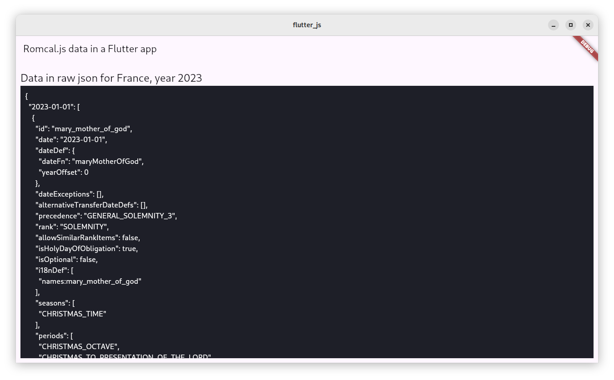

# romcal-flutter
Proof of concept: integration of Romcal in a Flutter app



# Romcal 

You need nodejs > 20 and yarn. 
Then install dependencies with `yarn`
Then generate the data files for this POC with `node romcal.js`

This file is a very quick example to generate json files for the last year, the current year and the 10 next years, for the liturgy in France. 

Theses files are outputed in `assets/` and embeded in the Flutter app. 

Romcal [doc](https://github.com/romcal/romcal/blob/dev/README.md#getting-started)

# Flutter

I use [fvm](https://fvm.app/) to manage Flutter version locally. install it and run 
```
fvm use 3.27.1
```

Then use `fvm` as a prefix for all `flutter` commands. 

Run: `fvm flutter run`
Build: `fvm flutter build <platform>` 

The Flutter app will start and just show the raw json data for 2023 liturgy in France. It's simple, but with this we are sure we can build something that will work!
- Data is local (embbeded)
- Data can be updated very easily at build time 
  - By a CI
  - Romcal is not modified at all (no rewrite in another language)
- We can expand to have many calendars, years, langages, propres (sky is the limit